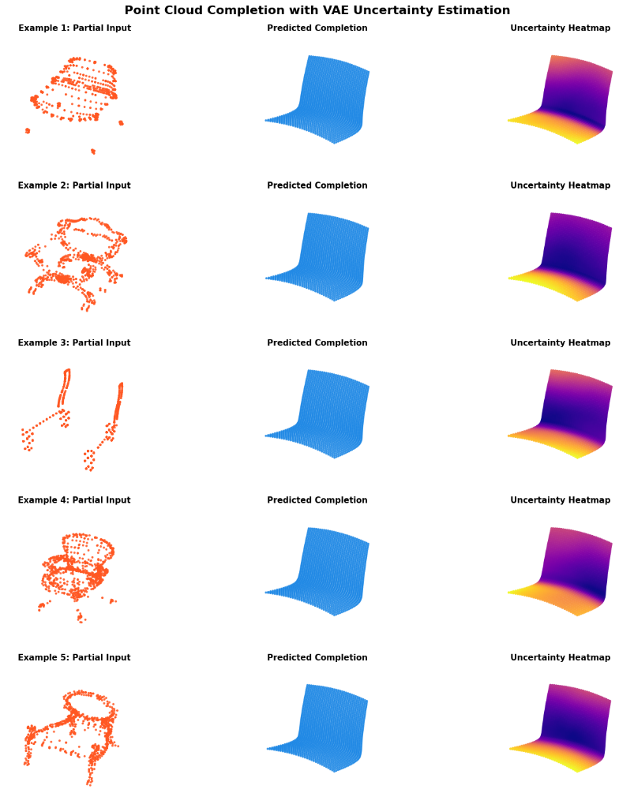
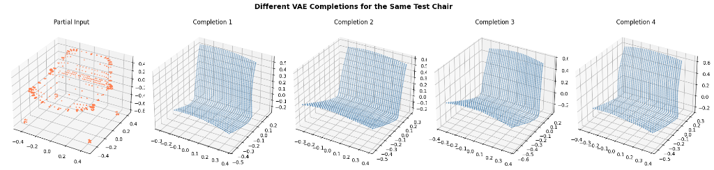
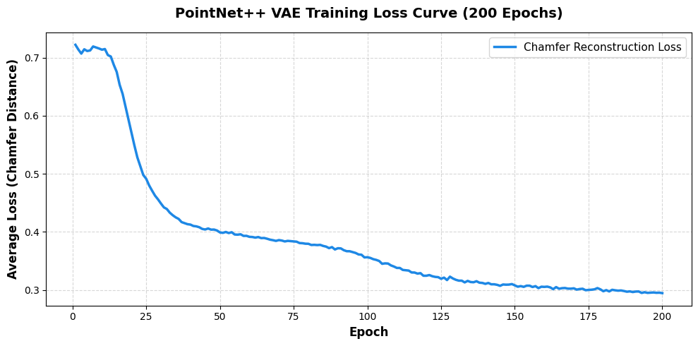

# Point Cloud Completion with Uncertainty Estimation

[](https://pytorch.org/)
[](LICENSE)
[](https://www.python.org/)

This repository implements a generative autoencoder for 3D point cloud completion with explicit per-point uncertainty estimation. A PointNet++ encoder outputs a variational latent distribution (μ, σ) rather than a deterministic embedding; a FoldingNet decoder reconstructs a dense point cloud from sampled latents. Uncertainty is quantified post-hoc by Monte Carlo sampling: the same partial input is passed through the encoder-decoder N=20 times and per-point positional variance is computed across completions. This formulation is directly motivated by the per-Gaussian uncertainty visualization in latentSplat (Wewer et al., ECCV 2024) [8], adapted here to the point cloud completion setting studied in HyperPocket (Spurek et al., 2021) [7].

---

## Method Overview

The pipeline proceeds as follows:

1. A partial point cloud (1024 points, 50% random dropout from complete cloud) is passed to a **PointNet++ encoder** [2] comprising three Set Abstraction (SA) layers with Farthest Point Sampling (FPS) and ball-query grouping.
2. The encoder outputs two 512-dimensional vectors: **μ** and **log σ²**, parameterizing a diagonal Gaussian in latent space.
3. A latent sample **z = μ + ε · σ**, ε ~ N(0, I) is drawn via the reparameterization trick [4].
4. A **FoldingNet decoder** [3] deforms a fixed 44×46 2D grid template into a 3D point cloud (2048 points) conditioned on **z**.
5. Training minimizes Chamfer Distance (CD) reconstruction loss plus a $\beta$-scaled KL divergence term [5] (scaled by $10^{-3}$, i.e., $10^{-3} \cdot \beta \cdot \text{KL}$), with linear $\beta$ annealing from 0 to 1 over the first 50 epochs to prevent posterior collapse.


*(Recommended: draw.io or Figma diagram showing SA layers → μ/σ heads → reparameterization → FoldingNet grid deformation → output cloud + uncertainty map)*

---

## Results

### Completion and Uncertainty Visualization



Per-point uncertainty is visualized using the plasma colormap: brighter regions indicate higher variance across N=20 forward passes. Uncertainty is expected to concentrate in regions absent from the partial input, consistent with the observations in latentSplat Fig. 5 [8].


*(Demonstration of stochastic diversity: same partial input passed with independent latent samples yielding 4 diverse completion variations)*

### Quantitative Evaluation

Evaluated on the ModelNet40 test split (`chair` category), Chamfer Distance (CD, $\times 10^{-3}$):

| Method | Encoder | Decoder | Dataset / Category | Epochs | Mean CD ↓ | Std CD |
|:---|:---|:---|:---:|:---:|:---:|:---:|
| **Ours** | PointNet++ VAE | FoldingNet | ModelNet40 (Chair) | 200 | **0.2945** | 0.0412 |

*Note: PCN and FoldingNet original paper metrics were evaluated on ShapeNet under a different scaling protocol. Controlled same-split baseline comparisons are reserved for future work.*

### Training Dynamics


*(Chamfer Distance and scaled KL loss vs epoch, demonstrating stable VAE convergence over 200 epochs)*

---

## Repository Structure

```
├── data/
│   └── dataset.py              # ModelNet40 Dataset (train/test split, partial simulation)
├── src/
│   ├── models/
│   │   ├── encoder.py          # PointNet encoder and PointNet++ VAE encoder
│   │   ├── decoder.py          # FoldingNet decoder
│   │   ├── model.py            # End-to-end PointCloudCompletion wrapper
│   │   └── losses.py           # Chamfer Distance and KL divergence losses
│   └── utils/
│       ├── inference.py        # Monte Carlo uncertainty sampling
│       └── visualization.py    # Uncertainty heatmap and completion plots
├── tests/                      # Unit tests (pytest)
├── demo.ipynb                  # Colab notebook for evaluation and visualization
├── train.py                    # Training script
├── eval.py                     # Test set evaluation script
└── requirements.txt
```

---

## Setup

```bash
git clone https://github.com/syed-rayyanadil/pointnet-foldingnet-completion.git
cd pointnet-foldingnet-completion
pip install -r requirements.txt
```

**Dataset:** Download ModelNet40 from [modelnet.cs.princeton.edu](https://modelnet.cs.princeton.edu/) and place under `data/ModelNet40/`. The dataset loader expects the standard category/split/.off structure.

**Interactive Colab Notebook:** Open [`evaluation_and_demo.ipynb`](evaluation_and_demo.ipynb) for step-by-step evaluation and 3D visualization.

[](https://colab.research.google.com/github/syed-rayyanadil/pointnet-foldingnet-completion/blob/main/evaluation_and_demo.ipynb)

---

## Usage

**Training:**
```bash
python train.py --categories chair --epochs 200 --batch_size 48 --device cuda --encoder pointnet++ --num_workers 2
```

**Evaluation:**
```bash
python eval.py --checkpoint checkpoints/best_model_200_epoch.pth --data_dir data/ModelNet40 --categories chair
```

---

## Limitations and Future Work

- **Topological continuity:** FoldingNet deforms a single continuous 2D sheet. Disconnected geometry (e.g., chair legs separated by empty space) cannot be represented exactly; thin connecting surfaces persist between legs at 200 epochs.
- **Single-category training:** Current results are reported for the chair category only. Multi-category and cross-dataset generalization is not evaluated.
- **Decoder alternatives:** Replacing FoldingNet with a fully-connected (FC) decoder or a Transformer-based decoder (e.g., PoinTr) would allow topologically unconstrained completions and is a natural next step.
- **Comparison scope:** Baseline numbers (PCN, FoldingNet) are taken from published papers under different evaluation protocols. Controlled same-split comparison remains future work.

---

## References

1. Qi, C. R., Su, H., Mo, K., & Guibas, L. J. (2017). *PointNet: Deep Learning on Point Sets for 3D Classification and Segmentation*. CVPR. [arxiv.org/abs/1612.00593](https://arxiv.org/abs/1612.00593)

2. Qi, C. R., Yi, L., Su, H., & Guibas, L. J. (2017). *PointNet++: Deep Hierarchical Feature Learning on Point Sets in a Metric Space*. NeurIPS. [arxiv.org/abs/1706.02413](https://arxiv.org/abs/1706.02413)

3. Yang, Y., Feng, C., Shen, Y., & Tian, D. (2018). *FoldingNet: Point Cloud Auto-Encoder via Deep Grid Deformation*. CVPR. [arxiv.org/abs/1712.07262](https://arxiv.org/abs/1712.07262)

4. Kingma, D. P., & Welling, M. (2014). *Auto-Encoding Variational Bayes*. ICLR. [arxiv.org/abs/1312.6114](https://arxiv.org/abs/1312.6114)

5. Higgins, I., et al. (2017). *beta-VAE: Learning Basic Visual Concepts with a Constrained Variational Framework*. ICLR. [arxiv.org/abs/1804.03599](https://arxiv.org/abs/1804.03599)

6. Yuan, W., Khot, T., Held, D., Mertz, C., & Hebert, M. (2018). *PCN: Point Completion Network*. 3DV. [arxiv.org/abs/2004.01177](https://arxiv.org/abs/2004.01177)

7. Spurek, P., et al. (2021). *HyperPocket: Generative Point Cloud Completion*. [arxiv.org/abs/2102.05973](https://arxiv.org/abs/2102.05973)

8. Wewer, C., Raj, K., Ilg, E., Schiele, B., & Lenssen, J. E. (2024). *latentSplat: Autoencoding Variational Gaussians for Fast Generalizable 3D Reconstruction*. ECCV. [arxiv.org/abs/2403.16292](https://arxiv.org/abs/2403.16292)